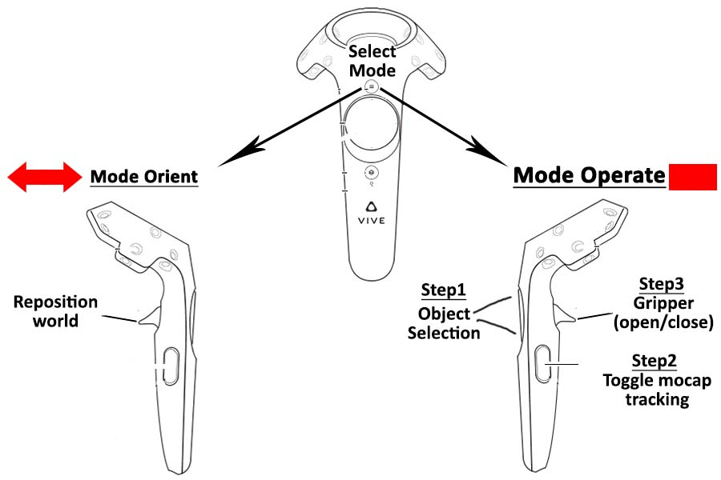

# PUPPET installation

## Requirements
Vive headset and a minimum of one active controller. Optional equipments include additional vive controllers, vive trackers, and cyberglove.

## Build and install for Linux
1. Ensure you have installed Nvidia driver
2. Install steam
    1. `sudo apt-get install steam`
    2. `steam`
    3. When you run steam, you will likely encounter some errors:
        - `libGL error: no matching fbConfigs or visuals found`. Type `sudo lpconfig -p | grep -i gl.so` to see the version of your Nvidia driver and install the i386 version of libGL, e.g. `sudo apt install libnvidia-gl-460:i386`
        - `LibGL error: failed to load driver: swrast`. [Try this post](https://www.errorsolutions.tech/error/libgl-error-failed-to-load-driver-swrast/)
3. Install Mujoco.
    - Extract to `~/.mujoco/mujoco200/...` (instead of `mujoco200_linux`).
    - Place mjkey.txt in `~/.mujoco`
    - Add to source `export MUJOCOPATH=~/.mujoco/`
4. On Linux Build branch, edit `build/makefile`
    - `MJ_PATH`
    - `PUPPET_PATH`
5. `cd puppet/build; make` will create puppet and playlog
6. `ldd puppet` to ensure all libraries are found
7. puppet will call `~/.local/share/Steam/steamapps/common/SteamVR/bin/linux64/vrmonitor`. When you run puppet for the first time you will likely see many errors, caused by this vrmonitor failing to find libraries. Some fixes:
    - Cannot find libsteam-api.so. `export LD_LIBRARY_PATH=$LD_LIBRARY_PATH:/home/user/.local/share/Steam/steamapps/common/SteamVR/bin/linux64/`
    - Cannot find libQt5Multimedia.so.5. `sudo apt install libqt5multimedia5`
    - Cannot find libudev.so.0. You should first find your [STEAM RUNTIME wrapper](https://github.com/flathub/com.valvesoftware.Steam/issues/640). e.g. It is at `~/.local/share/Steam/ubuntu12_32/steam-runtime/run.sh`. Then, wrap puppet in the runtime environment by `~/.local/share/Steam/ubuntu12_32/steam-runtime/run.sh ./puppet humanoid.xml` (note how we pass the argument for puppet in).

## Usage
1. puppet is used for emersive visualization and interaction with the mujoco worlds.
2. playlog is can be used to replay recorded logs and dump raw video (Key F9 to start stop video recording) (pixel_format rgb24).   


**Note1**: Logs are dumped in mujoco's .mjl format. Refer [Mujoco documenation](http://www.mujoco.org/book/haptix.html#uiRecord) for details.  
**Note2**: You can use [ffmpeg](https://ffmpeg.org/) to convert the raw video. Ensure that the video resolution and fps matches with the settings used while dumping raw video.
```
ffmpeg -f rawvideo -pixel_format rgb24 -video_size 800x800 -framerate 60 -i rgb.out -vf "vflip" video.mp4
```


## Bindings
### Controller
<p align="center"></p>

Controller have two modes

1. **Orient**:  Move and reposition the world with respect to the user
    * __trigger__ - Engage repositioning
    * __up/F8__      - Toggle mocap1
    * __down/F7__    - Toggle mocap0
    * __right/F6__   - Toggle log saving
    * __left/backspace__    - Reset the world (optionally save logs, if recorded) 

2. **Operate**:  TeleOperate the scene via controller/ trackers/ external devices
    * __Step1__ - Use the up/down pad button to select the body of interest 
    * __Step2__ - Use the side button to toggle between purturbation and no purturbation
    * __Setp3__ - Use the trigger to apply special purturbation
    * __Step4__ - Use the left pad button to reset the world


### Keyboard
In addiiton to the usual Mujoco key bindings following Puppet specific bindings are available. 
* __F6__ - Dump logs toggle
* __F7__ - Bind controller0 toggle
* __F8__ - Bind controller1 toggle
* __F9__ - Video recording toggle (only in `playlog.exe`)


## Special cases 

### Controller/Mocap configuration
Am xml with a mocap body called "mocap0/mocap1" gets associated with controller0/controller1 and places the controller in the "vTOOL_PULL" mode.

### Fetch
While the vive driver is general purpose, There are fetch-gripper specific utilities that are provided if the xml loaded has two actuators with following names: "r_gripper_finger_joint" and "l_gripper_finger_joint"

## Trouble shooting 
1. Vive tracker not detected? - you need to add Vive Tracker into SteamVR. Rightclick on one of the existing controller’s icon and click “Pair Controller” in the pop-up menu. Press the Power button on Vive Tracker for 2 seconds, and then release it to enter the paring mode. Note that if you have two Vive controllers already, then you will need to plug the dongle into the dongle cradle to PC’s USB port. More details can be found here [Vive Tracker developer guide](https://dl.vive.com/Tracker/Guideline/HTC_Vive_Tracker_Developer_Guidelines_v1.3.pdf)
2. Vive-chaperone is in your view? - Vive doesn't allow you to fully disable the chaperon from the scene. However the chaperone can be removed from the view by tuning its alpha value to zero. Restart steaemVR for the new settings to take effect. 
```
C:\Program Files (x86)\Steam\config\steamvr.vrsettings\collisionBounds: "CollisionBoundsColorGammaA" : 0
``` 
